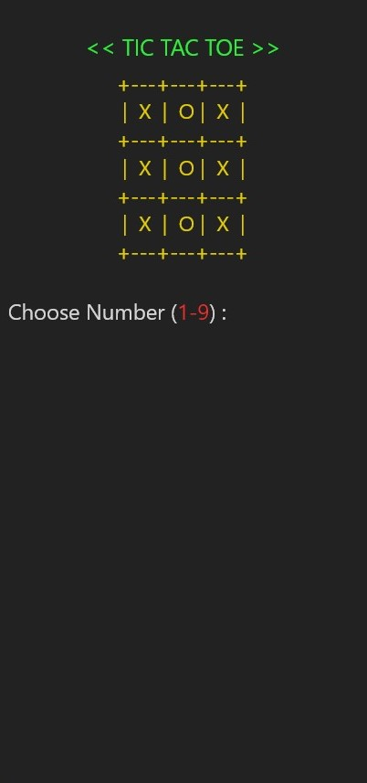

# **TicTacToe Game** Project
this is a my project TicTacToe Game 

## **Run Game**
**.jar** stored in the target folder
```bash
java -jar TicTacToe-Game.jar
```

## **Prototype TicTacToe Game**
[download](https://xd.adobe.com/view/f2883775-a828-4916-ae40-110dec3dfe66-a7db/) this prototype tictactoe game.


## **Explanation Code**
1.  data model tictactoe
    ```java
    public static Character[][] modelGameBoard = {
            {'+','-','-','-','+','-','-','-','+','-','-','-','+'},
            {'|',' ',' ',' ','|',' ',' ',' ','|',' ',' ',' ','|'},
            {'+','-','-','-','+','-','-','-','+','-','-','-','+'},
            {'|',' ',' ',' ','|',' ',' ',' ','|',' ',' ',' ','|'},
            {'+','-','-','-','+','-','-','-','+','-','-','-','+'},
            {'|',' ',' ',' ','|',' ',' ',' ','|',' ',' ',' ','|'},
            {'+','-','-','-','+','-','-','-','+','-','-','-','+'},
    };
    ```

2. Business Login TicTacToe Game
    ```java
    public class TicTacToe {
        private static final String PLAYER = "PLAYER";
        private static final String COMPUTER = "COMPUTER";

        public static final ArrayList<Integer> savePlayerNumberPosition = new ArrayList<>();
        public static final ArrayList<Integer> saveComputerNumberPosition = new ArrayList<>();
        
        private static boolean stop = true;


        public static void printGameBoard() {
            for (Character[] characters : modelGameBoard) {
                System.out.print("\t ");
                for (var column = 0; column < 13; column++) {
                    System.out.print(YELLOW+ characters[column]+ RESET);
                }
                System.out.print("\n");
            }
        }


        public static boolean playerChoosePosition(Integer numberPosition) {
            return numberPosition >= 1 && numberPosition <= 9;
        }


        public static Integer computerChoosePosition() {
            Random random = new Random();
            return random.nextInt(9) + 1;
        }


        public static void inputChoosePosition(String user, Integer userPosition) {
            Character symbol = null;
            if (user.equals("PLAYER")) {
                symbol = 'X';
                savePlayerNumberPosition.add(userPosition);
            }
            if (user.equals("COMPUTER")) {
                symbol = 'O';
                saveComputerNumberPosition.add(userPosition);
            }

            switch (userPosition) {
                case 1: modelGameBoard[1][2] = symbol; break;
                case 2: modelGameBoard[1][6] = symbol; break;
                case 3: modelGameBoard[1][10] = symbol; break;
                case 4: modelGameBoard[3][2] = symbol; break;
                case 5: modelGameBoard[3][6] = symbol; break;
                case 6: modelGameBoard[3][10] = symbol; break;
                case 7: modelGameBoard[5][2] = symbol; break;
                case 8: modelGameBoard[5][6] = symbol; break;
                case 9: modelGameBoard[5][10] = symbol; break;
                default: break;
            }
        }


        public static String checkWinner() {
            ArrayList<List> linePositionWinning = new ArrayList<>();

            List<Integer> rowsTop = List.of(1,2,3);
            List<Integer> rowsMid = List.of(4,5,6);
            List<Integer> rowsBottom = List.of(7,8,9);
            List<Integer> colLeft = List.of(1,4,7);
            List<Integer> colMid = List.of(2,5,8);
            List<Integer> colRight = List.of(3,6,9);
            List<Integer> cross1 = List.of(1,5,9);
            List<Integer> cross2 = List.of(3,5,7);

            linePositionWinning.add(rowsTop);
            linePositionWinning.add(rowsMid);
            linePositionWinning.add(rowsBottom);
            linePositionWinning.add(colLeft);
            linePositionWinning.add(colMid);
            linePositionWinning.add(colRight);
            linePositionWinning.add(cross1);
            linePositionWinning.add(cross2);

            for (var i = 0; i < linePositionWinning.size(); i++) {
                if (savePlayerNumberPosition.containsAll(linePositionWinning.get(i))) {
                    stop = false;
                    return PURPLE+"Congratulation You Won..!"+RESET;
                }else if (saveComputerNumberPosition.containsAll(linePositionWinning.get(i))) {
                    stop = false;
                    return PURPLE+"Computer Won..!"+RESET;
                }else if (savePlayerNumberPosition.size() + saveComputerNumberPosition.size() == 9) {
                    return PURPLE+"Series!"+RESET;
                }
            }

            return "";
        }      
    }
    ```

3. View
    ```java
    public static void viewMain() {
        viewTicTacToe();

        while (stop) {
            var player = viewPlayerChoose();
            var computer = computerChoosePosition();

            if (savePlayerNumberPosition.size() == 4) {
                inputChoosePosition(PLAYER, player);
                viewTicTacToe();
                System.out.println(checkWinner());
                break;
            }

            while (savePlayerNumberPosition.contains(player) || saveComputerNumberPosition.contains(player)) {
                System.out.println(RED_BOLD+"Take Another Position!!"+RESET);
                player = viewPlayerChoose();
            }
            inputChoosePosition(PLAYER, player);

            while (savePlayerNumberPosition.contains(computer) || saveComputerNumberPosition.contains(computer)) {
                computer = computerChoosePosition();
            }
            inputChoosePosition(COMPUTER, computer);


            viewTicTacToe();
            String result = checkWinner();
            System.out.println(result);
        }
    }


    public static void viewTicTacToe() {
        System.out.println(GREEN_BOLD+"\t<< TICTACTOE >>"+RESET);
        printGameBoard();
    }


    public static Integer viewPlayerChoose() {
        System.out.print("Choose Number ("+RED+"1-9"+RESET+") : ");
        Integer numberPosition = scan.nextInt();

        var valid = playerChoosePosition(numberPosition);
        if (!valid) {
            System.out.println(RED_BOLD+"You Choose Position Number "+numberPosition+" Not Found!\n"+RESET);
            stop = false;
        }
        System.out.println("\n");
        return  numberPosition;
    }
    ```